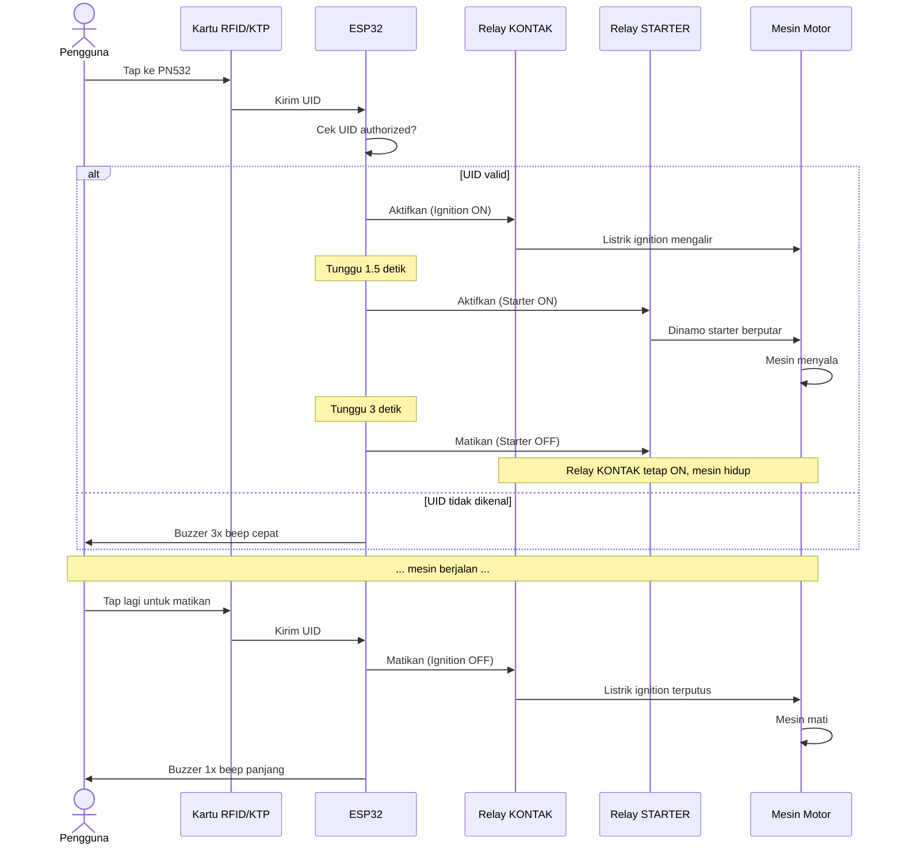

# SIKAMOT-V2 — Wiring Diagram

## Komponen yang Dibutuhkan

| No | Komponen | Qty | Keterangan |
|----|----------|-----|------------|
| 1 | ESP32 DEVKITC V4 WROOM-32D | 1 | Mikrokontroler utama |
| 2 | PN532 NFC/RFID Module | 1 | Pembaca kartu RFID/KTP |
| 3 | Relay Module 2-Channel (Active LOW) | 1 | Dikendalikan ESP32 |
| 4 | Relay Otomotif 12V 40A **4 kaki** | 2 | Relay kontak + relay starter |
| 5 | Active Buzzer 5V | 1 | Feedback suara |
| 6 | Transistor NPN S8050 atau 2N2222 | 1 | Driver buzzer |
| 7 | Resistor 1kΩ | 1 | Base transistor buzzer |
| 8 | Step-down module LM2596 / MP1584 | 1 | Konversi 12V → 5V |
| 9 | Kabel jumper | secukupnya | |
| 10 | Fuse 1A | 1 | Proteksi jalur step-down |
| 11 | Soket relay otomotif 4 kaki | 2 | Opsional, mempermudah pemasangan |

---

## Pinout ESP32 DEVKITC V4 WROOM-32D

```
                     ┌─────────────┐
              GND ───┤ GND     3V3 ├─── 3.3V
              IO23 ──┤ D23     GND ├─── GND
              IO22 ──┤ D22    IO15 ├
              TX0  ──┤ TX0    IO2  ├
              RX0  ──┤ RX0    IO0  ├
              IO21 ──┤ D21    IO4  ├─── PN532 IRQ
              GND ───┤ GND     IO16├
              IO19 ──┤ D19    IO17 ├
              IO18 ──┤ D18     IO5 ├─── PN532 SS (SPI only)
              IO5  ──┤ D5     IO18 ├─── PN532 SCK (SPI only)
              IO26 ──┤ D26    IO19 ├─── PN532 MISO (SPI only)
              IO25 ──┤ D25    IO23 ├─── PN532 MOSI (SPI only)
              IO17 ──┤ D17    IO21 ├─── PN532 SDA (I2C only)
              IO16 ──┤ D16    IO22 ├─── PN532 SCL (I2C only)
              GND  ──┤ GND    IO25 ├─── Buzzer (via transistor)
              VIN  ──┤ VIN    IO26 ├─── Relay ON (Kontak)
                     │        IO27 ├─── Relay STARTER
                     └─────────────┘
```

> Pin yang digunakan: IO4, IO5, IO18, IO19, IO21, IO22, IO23, IO25, IO26, IO27

---

## 1. Wiring Power (12V ke ESP32)

```
Aki Motor 12V (+) ──── Fuse 1A ──── Step-down IN(+)
Aki Motor 12V (-) ──────────────── Step-down IN(-)

Step-down OUT(+) 5V ──── ESP32 VIN
                    └─── Relay Module VCC (JD-VCC)
Step-down OUT(-) GND ─── ESP32 GND
                     └── Relay Module GND
                     └── Common GND sistem
```

> **Penting:** Set step-down ke 5V dulu sebelum disambungkan ke ESP32.
> Gunakan multimeter untuk verifikasi output = 5.0V.

---

## 2. Wiring PN532 — Mode SPI (Branch: `spi`)

### DIP Switch PN532 untuk SPI:
| Switch | Posisi |
|--------|--------|
| SW1 (SEL0) | **ON** |
| SW2 (SEL1) | **OFF** |

### Koneksi:
| PN532 Pin | ESP32 Pin | Keterangan |
|-----------|-----------|------------|
| VCC | 3.3V | Daya PN532 (3.3V) |
| GND | GND | Ground |
| SCK | GPIO 18 | SPI Clock |
| MISO | GPIO 19 | SPI MISO |
| MOSI | GPIO 23 | SPI MOSI |
| SS/NSS | GPIO 5 | SPI Chip Select |
| IRQ | GPIO 4 | Interrupt (opsional tapi disarankan) |
| RSTO | — | Tidak perlu disambung |

```
ESP32              PN532
3.3V  ────────────  VCC
GND   ────────────  GND
IO18  ────────────  SCK
IO19  ────────────  MISO
IO23  ────────────  MOSI
IO5   ────────────  SS
IO4   ────────────  IRQ
```

---

## 3. Wiring PN532 — Mode I2C (Branch: `i2c`)

### DIP Switch PN532 untuk I2C:
| Switch | Posisi |
|--------|--------|
| SW1 (SEL0) | **OFF** |
| SW2 (SEL1) | **ON** |

### Koneksi:
| PN532 Pin | ESP32 Pin | Keterangan |
|-----------|-----------|------------|
| VCC | 3.3V | Daya PN532 |
| GND | GND | Ground |
| SDA | GPIO 21 | I2C Data |
| SCL | GPIO 22 | I2C Clock |
| IRQ | GPIO 4 | Interrupt |
| RSTO | — | Tidak perlu disambung |

```
ESP32              PN532
3.3V  ────────────  VCC
GND   ────────────  GND
IO21  ────────────  SDA
IO22  ────────────  SCL
IO4   ────────────  IRQ
```

> **Catatan I2C:** PN532 sudah punya pull-up internal. Jika ada masalah koneksi,
> tambahkan resistor pull-up 4.7kΩ dari SDA ke 3.3V dan SCL ke 3.3V.

---

## 4. Wiring Relay Module 2-Channel ke ESP32

**Wajib lepas jumper JD-VCC–VCC** sebelum menyambung.

```
Step-down 5V ──── Relay JD-VCC  (daya relay coil)
ESP32 3.3V   ──── Relay VCC     (daya optocoupler)
Step-down GND ─── Relay GND
ESP32 GND    ──── Relay GND (sisi kedua)

ESP32 IO26   ──── Relay IN1  (Relay Kontak/ON)
ESP32 IO27   ──── Relay IN2  (Relay Starter)
```

> **Active LOW:** GPIO LOW = Relay ON, GPIO HIGH = Relay OFF
>
> **Kenapa harus dipisah?** Saat ESP32 mati, pin GPIO menjadi floating dan
> dioda proteksi internal ESP32 menarik pin IN ke GND → relay aktif tidak sengaja.
> Dengan memisahkan VCC optocoupler ke 3.3V ESP32, saat ESP32 mati optocoupler
> ikut mati → relay tidak bisa aktif walau IN floating.

---

## 5. Wiring Relay Otomotif (Automotive Relay 12V)

### Pinout Relay Otomotif 4 Kaki:
```
         ┌──────────┐
  85 ────┤ Coil (-) ├───── GND
  86 ────┤ Coil (+) ├───── 12V (dari relay module)
  30 ────┤ Common   ├───── Sumber (input)
  87 ────┤ NO       ├───── Tujuan (output, aktif saat relay ON)
         └──────────┘
```

> Relay 4 kaki tidak punya pin 87a (NC). Semua koneksi hanya lewat pin 30 → 87.

### Relay Kontak (Ignition ON):

```
Relay Module OUT1:
  COM ──── Aki 12V (+)
  NO  ──── Pin 86 Automotive Relay Kontak

Automotive Relay Kontak:
  Pin 85  ──── GND (massa motor/bodi)
  Pin 86  ──── NO dari Relay Module OUT1
  Pin 30  ──── Jalur kontak asli motor (kabel yang dihidupkan kunci kontak)
  Pin 87  ──── Jalur ignition bus motor (distribusi ke semua sistem kelistrikan)
```

Cara kerja: saat ESP32 aktifkan relay module OUT1 → 12V masuk ke pin 86 → relay kontak menutup → pin 30 terhubung ke pin 87 → ignition ON.

### Relay Starter:

```
Relay Module OUT2:
  COM ──── Aki 12V (+)
  NO  ──── Pin 86 Automotive Relay Starter

Automotive Relay Starter:
  Pin 85  ──── GND (massa motor/bodi)
  Pin 86  ──── NO dari Relay Module OUT2
  Pin 30  ──── Satu sisi kabel tombol starter asli
  Pin 87  ──── Sisi lain kabel tombol starter (ke solenoid starter)
```

Cara kerja: saat ESP32 aktifkan relay module OUT2 → relay starter menutup → pin 30 terhubung ke pin 87 → simulasi tombol starter ditekan → dinamo berputar.

> **Penting:** Kabel motor berbeda tiap merek/model. Cek wiring diagram motor spesifik
> kamu. Cara paling aman: **paralel** relay dengan tombol/kunci yang sudah ada,
> bukan menggantikannya, agar kunci asli tetap berfungsi sebagai backup.

---

## 6. Wiring Buzzer 5V (via Transistor NPN)

```
                    ┌──── 5V (dari step-down)
                    │
               [Buzzer +]
               [Buzzer -]
                    │
               [Kolektor] NPN (S8050 / 2N2222)
               [Basis] ──── Resistor 1kΩ ──── ESP32 IO25
               [Emitor] ──── GND
```

Diagram detail:
```
5V ──────────── Buzzer(+)
                Buzzer(-) ──── Kolektor transistor
                               Emitor transistor ──── GND

ESP32 IO25 ──── R 1kΩ ──── Basis transistor
```

> Transistor sebagai switch: ketika IO25 HIGH (3.3V), transistor ON → buzzer bunyi.
> Ketika IO25 LOW, transistor OFF → buzzer diam.

---

## 7. Diagram Sistem Lengkap

### 7a. Wiring Flow — Semua Komponen

```mermaid
flowchart TD
    subgraph PWR["⚡ Power Supply"]
        AKI["AKI MOTOR 12V"]
        FUSE["FUSE 1A"]
        SD["STEP-DOWN\n12V → 5V"]
        AKI -->|12V| FUSE --> SD
    end

    subgraph MCU["🧠 Mikrokontroler"]
        ESP["ESP32 DevKit V4\nWROOM-32D"]
        PN532["PN532 RFID/NFC\nSPI: IO5·18·19·23\nI2C: IO21·22\nIRQ: IO4"]
    end

    subgraph DRIVER["🔀 Driver Output"]
        RM["RELAY MODULE 2-Channel\nActive LOW\nIN1: IO26  IN2: IO27\nJD-VCC: 5V  VCC: 3.3V"]
        NPN["Transistor NPN\nIO25 via R 1kΩ"]
        BUZ["BUZZER 5V Aktif"]
        NPN -->|Collector| BUZ
    end

    subgraph AUTOREL["⚙ Relay Otomotif 4-Kaki"]
        ARK["Relay KONTAK\nPin 86 ← 12V\nPin 85 → GND\nPin 30 → 87"]
        ARS["Relay STARTER\nPin 86 ← 12V\nPin 85 → GND\nPin 30 → 87"]
    end

    subgraph MOTOR["🏍 Kelistrikan Motor"]
        IGN["Jalur Ignition\nIgnition Bus"]
        STR["Jalur Starter\nSolenoid Starter"]
    end

    SD -->|"5V → VIN"| ESP
    SD -->|"5V → JD-VCC"| RM
    SD -->|"5V"| BUZ

    AKI -->|"12V → COM OUT1"| RM
    AKI -->|"12V → COM OUT2"| RM
    AKI -->|"12V → Pin 30"| ARK
    AKI -->|"12V → Pin 30"| ARS

    PN532 <-->|"SPI atau I2C"| ESP
    ESP -->|"3.3V → VCC optocoupler"| RM
    ESP -->|"IO26 sinyal IN1"| RM
    ESP -->|"IO27 sinyal IN2"| RM
    ESP -->|"IO25 + R 1kΩ"| NPN

    RM -->|"OUT1 NO → Pin 86"| ARK
    RM -->|"OUT2 NO → Pin 86"| ARS

    ARK -->|"Pin 87"| IGN
    ARS -->|"Pin 87"| STR
```



---

### 7b. Sequence — Urutan Menyalakan & Mematikan Mesin



---

## 8. Pola Suara Buzzer

| Kejadian | Pola |
|----------|------|
| Akses diterima / engine start | 2 beep pendek |
| Engine mati | 1 beep panjang |
| Akses ditolak | 3 beep cepat |
| Mode enroll aktif | 2 beep medium |
| Kartu ditambah | 3 beep cepat |
| Kartu dihapus | 2 beep panjang |
| First setup / boot | 1 beep panjang |

---

## 9. Web Portal (WiFi AP Mode)

- **SSID:** `SIKAMOT-V2`
- **Password:** `sikamot123`
- **URL:** `http://192.168.4.1`
- **Fitur:** Lihat status, daftar kartu, tambah/hapus kartu, setup master card

---

## Catatan Keselamatan

1. Selalu pasang **fuse** di jalur power dari aki
2. Pastikan semua sambungan **tersolder** atau menggunakan konektor yang kuat — getaran motor bisa melonggarkan kabel
3. Lindungi rangkaian dari air/hujan dengan enclosure yang sesuai
4. Uji sistem di luar kendaraan dulu sebelum dipasang permanen
5. Relay otomotif harus sesuai rating arus — gunakan minimal **40A relay** untuk jalur starter
6. Jaga kunci kontak asli tetap berfungsi sebagai backup
